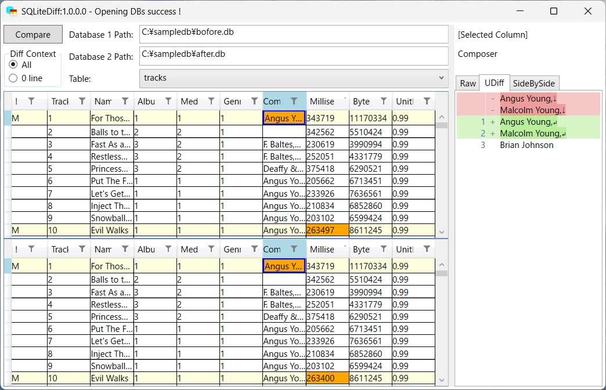

# SQLiteDiff

## About
SQLite Tabel Data diff by 2 DataGrid with colorize.

## Usage
1. Download dist/
2. Execute `SQLiteDiff.exe`

## Arguments
`$ SQLiteDiff.exe "db1Path" "db2Path"`  
Start with database paths loaded.

## Notice
- Tables from different schemas cannot be compared.
- Determine identical entries based on primary key.
